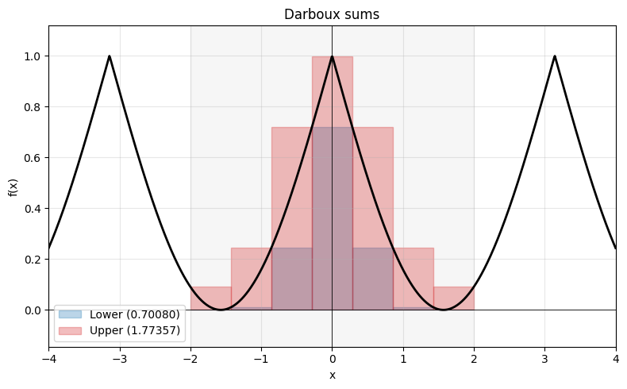
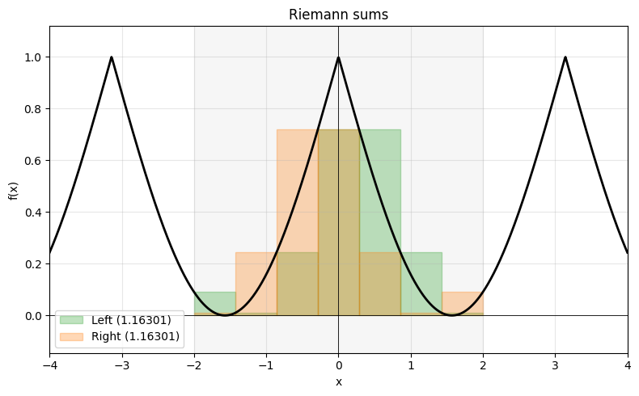

# Integration of one variable

Closes the single-variable arc started in `limits-and-derivatives`: the integral as accumulation, the definite integral as a limit of Riemann sums, and the fundamental theorem of calculus tying it back to the derivative. It is a direct prerequisite for the L2 analysis sequence — see *Connections to UPMC courses* at the end for where each thread is picked up.

## Status

`[~]` in progress — three MIT OCW lecture notes (definite integrals + both halves of the Fundamental Theorem of Calculus) downloaded; OpenStax and 3Blue1Brown wired in as references. No conversation yet, no cards yet.

## Materials

| # | Source | Topic |
|---|--------|-------|
| 01 | [MIT 18.01 Lecture 18 (PDF)](https://ocw.mit.edu/courses/18-01-single-variable-calculus-fall-2006/d1b3d809b6505825b5cde0cee823fa0f_lec18.pdf) | Definite integrals as limits of Riemann sums |
| 02 | [MIT 18.01 Lecture 19 (PDF)](https://ocw.mit.edu/courses/18-01-single-variable-calculus-fall-2006/817a2c46ddc23e2efda247a79ddeed34_lec19.pdf) | First Fundamental Theorem: $\int_a^b f = F(b) - F(a)$ |
| 03 | [MIT 18.01 Lecture 20 (PDF)](https://ocw.mit.edu/courses/18-01-single-variable-calculus-fall-2006/3cd98c68cec64e9214c8c9003f6cf983_lec20.pdf) | Second Fundamental Theorem: $\frac{d}{dx}\int_a^x f = f$ |
| 04 | [OpenStax Calculus Vol. 1, ch. 5–6](https://openstax.org/details/books/calculus-volume-1) | Textbook reference (not downloaded) |
| 05 | [3Blue1Brown — Essence of Calculus, ch. 8](https://www.youtube.com/watch?v=rfG8ce4nNh0) | Visual recap of integration and the Fundamental Theorem of Calculus |
| 06 | [SpetzoMath — Riemann (…Darboux) Integrals](https://www.youtube.com/watch?v=b_cfcC4eMyM) | Darboux integrability criterion and the Riemann ↔ Darboux distinction |
| 07 | [Jiří Lebl — *Basic Analysis I* (PDF)](https://www.jirka.org/ra/realanal.pdf) | Free real-analysis textbook; ch. 5 develops the Riemann integral via Darboux sums |

*Naming note: MIT 18.01 labels Lecture 19's evaluation form the "First" and Lecture 20's construction form the "Second" Fundamental Theorem; conventions differ across textbooks (Stewart and Wikipedia reverse them). The Theory section below presents the construction form first and refers to the two halves by name — construction form and evaluation form — rather than by ordinal.*

Main study material: MIT OCW 18.01 lecture notes (Prof. David Jerison, Fall 2006), under CC BY-NC-SA 4.0. OpenStax (also CC BY-NC-SA 4.0) is a textbook to consult when a topic needs more worked examples; 3Blue1Brown's chapter 8 is the visual perspective-opener.

If MIT 18.01 needs to be extended later, the integration unit continues with lectures 21–24 (applications: logarithms, volumes by disks/shells, work, numerical integration) and 26 (trig integrals, substitution).

## Cards

None yet — see `cards/integration-of-one-variable.txt` after the topic is closed.

## Theory

### 1. From accumulation to the definite integral

#### 1.1 Motivating problem

Differentiation measures *rate of change*. Integration is its mirror: it measures *accumulated total*. The archetypal question is "what is the area under the curve $y = f(x)$ between $x = a$ and $x = b$?", but the same machinery also computes total distance from a speed function, total charge from a current, total cost from a marginal cost, etc. The unifying picture is: we have a quantity that varies along $[a, b]$ and we want its accumulated total over the interval.

#### 1.2 Partitions and Darboux sums

A *partition* of $[a, b]$ is a finite increasing sequence

$$a = x_0 < x_1 < x_2 < \cdots < x_n = b,$$

cutting the interval into $n$ sub-intervals $[x_{i-1}, x_i]$ of length $\Delta x_i = x_i - x_{i-1}$. Given a bounded function $f$ on $[a, b]$, on each sub-interval set

$$m_i = \inf_{x \in [x_{i-1}, x_i]} f(x), \qquad M_i = \sup_{x \in [x_{i-1}, x_i]} f(x).$$

The *lower Darboux sum* and *upper Darboux sum* are

$$L(f, P) = \sum_{i=1}^n m_i \, \Delta x_i, \qquad U(f, P) = \sum_{i=1}^n M_i \, \Delta x_i.$$

Geometrically, $L$ is the area of the tallest staircase that stays below the graph, $U$ the shortest staircase that covers it. By construction $L(f, P) \le U(f, P)$ for every partition $P$.

#### 1.3 Riemann sums and the limit

A *Riemann sum* uses a free sample point $c_i \in [x_{i-1}, x_i]$ on each sub-interval, not the inf/sup:

$$S(f, P, \{c_i\}) = \sum_{i=1}^n f(c_i) \, \Delta x_i.$$

Always $L(f, P) \le S(f, P, \{c_i\}) \le U(f, P)$. If, as we refine the partition (taking the mesh $\max_i \Delta x_i$ to $0$), the lower and upper sums converge to the *same* limit, $f$ is called *Riemann integrable* on $[a, b]$, and that common limit is the **definite integral**

$$\int_a^b f(x)\,dx \;=\; \lim_{n \to \infty} \sum_{i=1}^n f(c_i)\,\Delta x_i.$$

The notation is suggestive: $\int$ is a stretched "S" for *sum*, $dx$ is an infinitesimal width, and the integrand $f(x)$ is the height being summed.

For uniform partitions on $[a, b]$ with $\Delta x = (b-a)/n$, the prototypical computation (MIT Lec 18, $f(x) = x^2$ on $[0, b]$) gives

$$\int_0^b x^2 \, dx = \lim_{n \to \infty} \frac{b^3}{n^3}(1^2 + 2^2 + \cdots + n^2) = \frac{b^3}{3},$$

using the staircase-pyramid bound $\tfrac{1}{3} n^3 < 1^2 + 2^2 + \cdots + n^2 < \tfrac{1}{3}(n+1)^3$.

#### 1.4 Sufficient conditions for integrability

The definition is delicate — not every bounded function is integrable. Two sufficient conditions cover essentially everything seen at this level:

- If $f$ is **continuous** on $[a, b]$, then $f$ is Riemann integrable on $[a, b]$.
- If $f$ is **bounded and piecewise continuous** (continuous except at finitely many points), then $f$ is Riemann integrable on $[a, b]$.

> [!WARNING]
> The classical pathology that *fails* is the Dirichlet function $\mathbf{1}_{\mathbb{Q} \cap [0, 1]}$: on every sub-interval $m_i = 0$ and $M_i = 1$, so $L \equiv 0$ and $U \equiv 1$ for every partition and the gap never closes. The Lebesgue integral is precisely the framework that makes such functions integrable.

#### 1.5 Signed area and basic properties

When $f \ge 0$, $\int_a^b f$ is the area under the graph. When $f$ dips below the axis, those contributions enter with a **minus sign** — the integral is a *signed* area:

$$\int_0^{2\pi} \sin x \, dx = 0$$

because the positive hump on $[0, \pi]$ and the negative hump on $[\pi, 2\pi]$ cancel.

The integral has three properties that get used constantly:

- **Linearity.** $\int_a^b \bigl(\alpha f + \beta g\bigr) = \alpha \int_a^b f + \beta \int_a^b g$.
- **Additivity over intervals.** $\int_a^b f + \int_b^c f = \int_a^c f$.
- **Monotonicity (estimation).** If $f \le g$ on $[a, b]$ with $a < b$, then $\int_a^b f \le \int_a^b g$. In particular $\bigl|\int_a^b f\bigr| \le \int_a^b |f|$.

By convention we extend the definition with

$$\int_a^a f(x)\,dx = 0, \qquad \int_b^a f(x)\,dx = -\int_a^b f(x)\,dx,$$

which makes additivity work for $a, b, c$ in any order and removes the ordering hypothesis from later statements.

### 2. Fundamental Theorem of Calculus — construction form

The Fundamental Theorem of Calculus has two faces. We develop the **construction form** first — it says that integrating up to a variable upper limit builds an antiderivative, and its proof needs nothing beyond the definition of the derivative — and then read the **evaluation form** off it as a short corollary.

#### 2.1 Statement

> **Fundamental Theorem of Calculus (construction form).** Let $f$ be continuous on $[a, b]$. Define
>
> $$G(x) = \int_a^x f(t)\,dt \qquad \text{for } x \in [a, b].$$
>
> Then $G$ is differentiable on $[a, b]$ with $G'(x) = f(x)$.

In words: *integration with a variable upper limit constructs an antiderivative*. Every continuous function has an antiderivative — namely, its own running accumulation from a base point.

#### 2.2 Proof sketch

Apply the definition of the derivative to $G$:

$$G'(x) = \lim_{h \to 0} \frac{G(x + h) - G(x)}{h}.$$

By additivity over intervals,

$$G(x + h) - G(x) = \int_a^{x+h} f(t)\,dt - \int_a^x f(t)\,dt = \int_x^{x+h} f(t)\,dt.$$

Geometrically this is the thin sliver of area between $x$ and $x + h$; its base is $h$ and its height is approximately $f(x)$, so

$$\frac{G(x + h) - G(x)}{h} = \frac{1}{h}\int_x^{x+h} f(t)\,dt$$

is the **average value** of $f$ over $[x, x+h]$. Continuity of $f$ at $x$ forces that average to converge to $f(x)$ as $h \to 0$ (formally: an $\varepsilon$-$\delta$ argument bounds $|f(t) - f(x)| < \varepsilon$ for $|t - x| < \delta$ and squeezes the average). Hence $G'(x) = f(x)$. $\quad\blacksquare$

Notice how little this uses: only the definition of the derivative, additivity of the integral, and continuity of $f$ — no Mean Value Theorem, and nothing proved later. That is what makes it the natural entry point.

#### 2.3 Existence of antiderivatives, and "new" functions

The construction form has a striking consequence: **every continuous function has an antiderivative**, even if no closed-form formula exists for it. Examples of functions that are continuous but whose antiderivatives are *not* expressible in elementary terms:

$$e^{-x^2}, \qquad \frac{\sin x}{x}, \qquad \sin(x^2), \qquad \cos(x^2), \qquad \frac{1}{\ln x}.$$

The way to *name* their antiderivatives is to declare them as integrals. This is how several special functions enter mathematics:

- **Error function.** $\operatorname{erf}(x) = \dfrac{2}{\sqrt{\pi}} \int_0^x e^{-t^2}\,dt$ — ubiquitous in probability (Gaussian tails).
- **Logarithmic integral.** $\operatorname{Li}(x) = \int_2^x \dfrac{dt}{\ln t}$ — counts primes up to $x$ (prime number theorem).
- **Fresnel integrals.** $C(x) = \int_0^x \cos(t^2)\,dt$, $S(x) = \int_0^x \sin(t^2)\,dt$ — optics.

Computing their derivatives is trivial by the construction form: $\operatorname{erf}'(x) = \tfrac{2}{\sqrt{\pi}} e^{-x^2}$, $C'(x) = \cos(x^2)$, etc.

### 3. Fundamental Theorem of Calculus — evaluation form

#### 3.1 Statement

> **Fundamental Theorem of Calculus (evaluation form).** Let $f$ be continuous on $[a, b]$ and let $F$ be any antiderivative of $f$ on $[a, b]$ (that is, $F' = f$). Then
>
> $$\int_a^b f(x)\,dx = F(b) - F(a).$$

The standard shorthand is $F(x)\Big|_a^b = F(b) - F(a)$. Two textbook applications:

$$\int_a^b x^2 \, dx = \left.\frac{x^3}{3}\right|_a^b = \frac{b^3 - a^3}{3}, \qquad \int_0^{\pi} \sin x \, dx = \bigl[-\cos x\bigr]_0^{\pi} = 2.$$

#### 3.2 Proof sketch (as a corollary of the construction form)

With the construction form in hand, the evaluation form is a two-line corollary. Define $G(x) = \int_a^x f(t)\,dt$; by the construction form $G' = f$, so $G$ is an antiderivative of $f$. Since two antiderivatives on an interval differ by a constant (a corollary of the Mean Value Theorem from [`limits-and-derivatives`](../limits-and-derivatives/README.md)), $F - G \equiv c$. Evaluating at $a$ gives $c = F(a)$, because $G(a) = 0$. Therefore

$$F(b) - F(a) = G(b) + c - c = G(b) = \int_a^b f(x)\,dx. \qquad \blacksquare$$

#### 3.3 Alternative proof, independent of the construction form

The evaluation form can also be proved on its own, without the construction form — the classical argument (Spivak, Apostol), which needs only the Mean Value Theorem and the fact that a continuous $f$ is integrable (established earlier, under *Sufficient conditions for integrability*).

Take any partition $a = x_0 < x_1 < \cdots < x_n = b$ and telescope the total change of $F$:

$$F(b) - F(a) = \sum_{i=1}^n \bigl[F(x_i) - F(x_{i-1})\bigr].$$

Since $F' = f$, $F$ is differentiable on each $[x_{i-1}, x_i]$, so the Mean Value Theorem supplies a sample point $c_i \in (x_{i-1}, x_i)$ with

$$F(x_i) - F(x_{i-1}) = F'(c_i)\,\Delta x_i = f(c_i)\,\Delta x_i.$$

Summing over $i$,

$$F(b) - F(a) = \sum_{i=1}^n f(c_i)\,\Delta x_i,$$

which is exactly a Riemann sum for $f$ with these Mean-Value-Theorem-chosen sample points. The left-hand side does not depend on the partition; and because $f$ is continuous it is integrable, so its Riemann sums converge to $\int_a^b f$ as the mesh $\max_i \Delta x_i \to 0$ for *any* choice of sample points. Letting the mesh tend to $0$,

$$F(b) - F(a) = \lim_{\max_i \Delta x_i \to 0} \sum_{i=1}^n f(c_i)\,\Delta x_i = \int_a^b f(x)\,dx. \qquad \blacksquare$$

The single step that needs integrability is the last one: for every partition the tagged sum *already* equals $F(b) - F(a)$, but only integrability lets us identify that common value with the integral $\int_a^b f$.

#### 3.4 What the evaluation form buys us

Without the evaluation form, computing $\int_0^b x^2 \, dx$ required summing $1^2 + 2^2 + \cdots + n^2$ and taking a limit. With it, the same answer falls out of "an antiderivative of $x^2$ is $x^3/3$". Integration is converted from a limit problem into an **antiderivative search**. That changes the practical character of the subject: most of single-variable integral calculus from here on is a catalogue of techniques (substitution, parts, partial fractions, trig identities) for finding antiderivatives.

### 4. Duality between integration and differentiation

The two halves of the Fundamental Theorem of Calculus, read together, say that on $\mathcal{C}^0([a, b])$ (continuous functions on $[a, b]$) the operations

$$f \longmapsto G_f(x) = \int_a^x f(t)\,dt \qquad \text{and} \qquad F \longmapsto F'$$

are mutually inverse — *up to a constant*:

- **Construction form:** $\dfrac{d}{dx} \int_a^x f(t)\,dt = f(x)$. Integrate then differentiate $\Rightarrow$ recover $f$ exactly.
- **Evaluation form, rearranged:** $\int_a^x F'(t)\,dt = F(x) - F(a)$. Differentiate then integrate $\Rightarrow$ recover $F$ *up to the additive constant $F(a)$*.

The constant is unavoidable for a structural reason: differentiation kills constants, so the inverse cannot possibly recover them — every $F + c$ has the same derivative, and the integral can only pin down $F$ to within that one-dimensional ambiguity.

This duality is the central organizing fact of single-variable calculus. A natural next question — *what is the right notion of integration so that this duality keeps working when $f$ is no longer continuous?* — is the entry point to Lebesgue integration.

### 5. Core techniques

Two techniques carry essentially all the working calculations in single-variable integration (and, later, the multivariable case). Both are the evaluation form read backwards: a derivative identity, run as an integration rule.

#### 5.1 Substitution (change of variable)

If $u = u(x)$ is differentiable and $g$ is continuous,

$$\int g(u(x))\, u'(x)\,dx = \int g(u)\,du.$$

For definite integrals, the bounds change too: with $u_1 = u(x_1)$ and $u_2 = u(x_2)$,

$$\int_{x_1}^{x_2} g(u(x))\, u'(x)\,dx = \int_{u_1}^{u_2} g(u)\,du.$$

Example: for $\int_1^2 (x^3 + 2)^4 \, x^2\,dx$, let $u = x^3 + 2$, so $du = 3x^2\,dx$. Bounds map $1 \mapsto 3$ and $2 \mapsto 10$, giving

$$\int_3^{10} u^4 \, \frac{du}{3} = \left.\frac{u^5}{15}\right|_3^{10} = \frac{10^5 - 3^5}{15}.$$

Substitution is the one-dimensional shadow of the *change-of-variable formula* in $\mathbb{R}^n$ (with a Jacobian determinant replacing $u'(x)$).

#### 5.2 Integration by parts

Reading the product rule $(uv)' = u'v + uv'$ as an integration statement:

$$\int_a^b u(x)\, v'(x)\,dx = \bigl[u(x)\, v(x)\bigr]_a^b - \int_a^b u'(x)\, v(x)\,dx.$$

The point is to trade an integral we cannot do for one we can, by moving the derivative from $v$ onto $u$. Recurring uses: $\int x e^x\,dx$ (take $u = x$, $v' = e^x$) and $\int \ln x\,dx$ (take $u = \ln x$, $v' = 1$); it is also a constant companion of Fourier-coefficient estimates.

### 6. Applications (placeholder — not developed this round)

Listed as bookmarks; not worked through here.

- **$\log$ via integral.** Defining $\log x = \int_1^x \tfrac{dt}{t}$ for $x > 0$ and recovering the algebraic properties of $\log$ purely from Fundamental Theorem of Calculus + change of variable. The cleanest "axiomatic" entry into the logarithm. (MIT Lec 20 trailer; full treatment in Lec 21.)
- **Volumes by disks / shells.** $\int \pi [f(x)]^2\,dx$, $\int 2\pi x\, f(x)\,dx$. Standard physical-geometry applications.
- **Work and accumulated physical quantities.** Total work as $\int F(x)\,dx$, total charge as $\int I(t)\,dt$, etc. The "borrowing function" example in MIT Lec 18 is a version of this.
- **Numerical integration.** Trapezoid rule, Simpson's rule, error bounds.

### 7. What this article deliberately leaves out

These are real and important but belong to later courses; pulling them in here would just blur the boundaries. The specific UPMC courses are listed in *Connections to UPMC courses* below.

- **Improper / generalized integrals** — integration over unbounded intervals or with unbounded integrands.
- **Multiple integrals, Fubini, multidimensional change of variable.**
- **Lebesgue integral** — the framework that integrates functions like the Dirichlet function flagged under *Sufficient conditions for integrability*.

## Connections to UPMC courses

Where the threads opened above get picked up in the distance Licence syllabus. These pointers are gathered here on purpose, so the theory stays focused on the mathematics rather than on curriculum bookkeeping.

### LU2MA260 — Analyse I

- **Improper / generalized integrals** — integration over unbounded intervals or with unbounded integrands, extending the definite integral developed earlier.
- **Integration by parts** returns as a workhorse, notably in Fourier-coefficient estimates.

### LU2MA211 — Analyse II

The most direct continuation of this topic, and the reason it sits where it does in the roadmap: it develops **Lebesgue integration on $\mathbb{R}^n$**, taking the Riemann integral built here as its motivation and reference point.

- **Lebesgue integral** — integrates functions the Riemann integral cannot, such as the Dirichlet function encountered earlier, and settles the duality question raised above: what notion of integration keeps integration and differentiation mutually inverse once $f$ is no longer continuous.
- **Multidimensional change of variable** — the several-variable generalization of substitution, with a Jacobian determinant in place of $u'(x)$.
- **Multiple integrals and Fubini's theorem.**

### LU3MA232 — Analyse numérique

- **Numerical integration** — the trapezoid rule, Simpson's rule, and their error bounds.

## Study log

- **2026-05-16** — Topic created. Materials 01–03 (MIT OCW lectures 18, 19, 20) downloaded; materials 04–05 (OpenStax, 3Blue1Brown) added as references without download. ROADMAP updated to mark the topic `[~]` in progress.
- **2026-05-18** — Theory section expanded from a 4-point through-line to a 7-section skeleton (titles + one-line intents). Scope deliberately bounded to Riemann + Fundamental Theorem of Calculus + core techniques; improper, multidimensional, and Lebesgue integration left to `Analyse I` / `Analyse II`.
- **2026-05-18** — Theory section fully written: Riemann sums and Darboux integrability conditions, the evaluation form of the Fundamental Theorem of Calculus with its construction-form-based proof, the construction form with its average-value proof and "new functions" via integral definition, the duality argument, and substitution and integration by parts. Applications kept as bookmarks, out-of-scope topics kept as a boundary list. Source: MIT OCW 18.01 lectures 18–20 (materials 01–03).
- **2026-05-21** — Materials 06 (SpetzoMath video on Riemann/Darboux integrability) and 07 (Jiří Lebl, *Basic Analysis I*) added to deepen the Darboux side of the opening definite-integral section, which MIT 18.01 treats only informally.
- **2026-05-25** — Moved the inline UPMC course references (Analyse I / Analyse II / Analyse numérique) out of the Theory section into a dedicated *Connections to UPMC courses* section, so the theory prose reads course-reference-free; the *What this article deliberately leaves out* list keeps the out-of-scope topics and now points to the new section.
- **2026-05-25** — Reworked the evaluation form's proof: it now carries the classical direct argument (telescoping + Mean Value Theorem + integrability of continuous functions), removing the forward reference to the construction form. The shorter construction-form-based derivation is kept as a deferred note for comparison.
- **2026-05-25** — Reordered the Fundamental Theorem of Calculus so the construction form ($\frac{d}{dx}\int_a^x f = f$) leads, proved straight from the definition of the derivative; the evaluation form ($\int_a^b f = F(b) - F(a)$) now follows as a corollary, with the telescoping + Mean Value Theorem argument kept as an independent alternative proof. Prose names the two halves descriptively (construction / evaluation form); the First/Second ordinals survive only in the Materials table, where a naming note was added.
